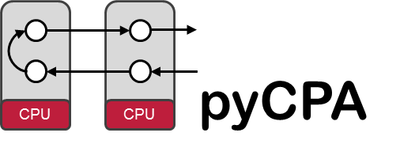

.. pycpa documentation master file, created by
   sphinx-quickstart on Mon Jan 30 14:17:05 2012.
   You can adapt this file completely to your liking, but it should at least
   contain the root `toctree` directive.

Welcome
=================================

pyCPA is a pragmatic Python implementation of Compositional Performance Analysis
(aka the SymTA/S approach provided by `Symtavision <http://www.symtavision.com>`_) 
used for research in worst-case timing analysis.
Unlike the commercial SymTA/S tool, pyCPA is not intended for commercial-grade use
and does not guarantee correctness of the implementation.

Contents:

.. toctree::
   :maxdepth: 2

   intro
   examples
   modules

Why pyCPA
---------   
Why not?
pyCPA is ideal for students who want to learn about real-time performance
analysis research as well as researchers who want to extend existing algorithms.
pyCPA is -as the name suggests- written in Python and extremely easy to use
and extend. If you want, you can easily plugin new schedulers or your own analyses.

pyCPA *should not* be used in any commercial-grade, safety-critical designs.

What does pyCPA?
----------------
Given, you have a (distributed) real-time system and you want to know about
worst-case (end-to-end) timing behavior, then you can use pyCPA to obtain these bounds.
You provide your architecture in the form of resources such as busses and 
cpus and the corresponding scheduling policies.
In a second step, you define your task-graph which is a specification
of task-communication (precedence relations) and tasks' properties (best/worst-case execution times).
pyCPA will then calculate the following metrics:

* worst-case response times (wcrt)
* end-to-end timing
* backlog (maximum buffer sizes)
* output event models

Features:
^^^^^^^^^
* schedulers: (non-)preemtive fixed priority , Round Robin, TDMA, FIFO
* event model with periodic, jitter, minimum distance support
* system analysis: event model propagation
* end to end analysis
* gantt-charts (spnp, spp only)
* graphviz plots of your taskgraph
* `SMFF <http://smff.sourceforge.net/>`_ support (through xml interface)

What pyCPA is not
-----------------
pyCPA cannot and won't obtain the worst-case execution time of a task
there is and will be no support for any specific protocols (e.g. Ethernet, CAN, ARINC, AUTOSAR, etc.).
Contact `Symtavision <http://www.symtavision.com>`_ if you need commercial support for any protocols.

Indices and tables
==================

* :ref:`genindex`
* :ref:`modindex`
* :ref:`search`

