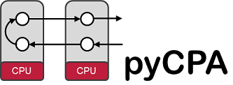

.. pycpa documentation master file, created by
   sphinx-quickstart on Mon Jan 30 14:17:05 2012.
   You can adapt this file completely to your liking, but it should at least
   contain the root `toctree` directive.

Welcome
=================================

pyCPA is a pragmatic Python implementation of Compositional Performance Analysis
(aka the SymTA/S approach provided by `Symtavision (now: Luxoft) <http://www.symtavision.com>`_) 
used for research in worst-case timing analysis.
Unlike the commercial SymTA/S tool, pyCPA is not intended for commercial-grade use
and does not guarantee correctness of the implementation.

Contents:

.. toctree::
   :maxdepth: 2

   install
   examples
   cmd_options
   modules
   bibliography

What does pyCPA do?
-------------------
Given, you have a (distributed) real-time system and you want to know about
worst-case (end-to-end) timing behavior, then you can use pyCPA to obtain these bounds.
You provide your architecture in the form of resources such as busses and 
CPUs and the corresponding scheduling policies.
In a second step, you define your task-graph which is a specification
of task-communication (precedence relations) and tasks' properties 
(best/worst-case execution times, priorities, activation patterns).
pyCPA will then calculate the following metrics:

* worst-case response times (WCRT) for tasks
* end-to-end timing for chains of tasks
* maximum backlog of task activations (maximum buffer sizes)
* output event models for tasks

An introduction to the approach is provided in [Henia2005]_.
If you want to understand the internals of pyCPA we advice to read the paper [Diemer2012b]_.

Features:
^^^^^^^^^
* schedulers: (non-)preemtive fixed priority , Round Robin, TDMA, FIFO
* event model with periodic, jitter, minimum distance support
* system analysis: event model propagation
* end to end analysis (event- and time-triggered chains)
* gantt-charts (spnp, spp only)
* graphviz plots of your taskgraph
* `SMFF <http://smff.sourceforge.net/>`_ support (through xml interface)

Why pyCPA
---------   
*Why not?*

* pyCPA is a reference implementation and ideal for students who want to learn about real-time performance analysis research as well as researchers who want to extend existing algorithms.

* pyCPA is -as the name suggests- written in Python and extremely easy to use and extend. If you want, you can easily plugin new schedulers or your own analyses.

* pyCPA is -as the name also suggests- a framework for Compositional Performance Analysis that particularly addresses complex heterogeneous systems. You can easily use distinct analyses for different processing resources, which makes testing a new analysis in a more complex and realistic environment extremely easy.

However, pyCPA *should not* be used in any commercial-grade, safety-critical designs. It does not provide analysis methods for commercial scheduling protocols like OSEK. 

What pyCPA is not
-----------------
pyCPA cannot and won't obtain the worst-case execution time of a task.
Also, there is and will be no support for any specific protocols (e.g. OSEK, Ethernet, CAN, ARINC, AUTOSAR, etc.).
Contact `Luxoft <https://auto.luxoft.com/uth/timing-analysis-tools/>`_ if you need commercial support for any protocols
or anything else that is beyond academic use-cases.

Indices and tables
==================

* :ref:`genindex`
* :ref:`modindex`
* :ref:`search`

