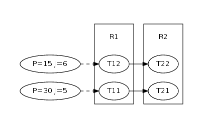

Static Priority Preemtive Example
=================================

In this section, we will dissect the spp example which is representative for the ideas behind pyCPA.
The full source code of the example is shown below.

pyCPA is NOT a tool! It rather is a package of methods and classes which 
can be embedded into your pyhon application - the spp example is such an example application.

Each analysis consists of two steps, we need to setup the architecture
and analyze it.

The architecture can be entered in two ways, either you provide it with the source code or you can use
a provided xml loader such as the symta or the smff loader.
However, in most cases it is sufficient to code your application directly in a python file.

.. First, each pyCPA application needs to call :py:func:`options.init_pycpa`.

Now, let's look at the example.
Before we actually start with the program, we import all pycpa modules which are needed for this example

.. literalinclude:: ../examples/spp-test.py
   :language: python
   :lines: 16-23
   
The interesting module are :py:mod:`pycpa.spp` which contains scheduler specific algorithms,
:py:mod:`pycpa.graph` which is used to plot a task graph of this example and :py:mod:`pycpa.options`
which controls various modes in which pyCPA can be executed.

The first step is to initialize the pyCPA environment.

.. literalinclude:: ../examples/spp-test.py
   :language: python
   :lines: 26-28

This will parse the pyCPA related options such as the propagation method, verbosity,
maximum-busy window, etc.
Conveniently, this also prints the optiones which will be used for your pyCPA session.
This is handy, when you run some analyses in batch jobs and want are uncertain about the exact settings after a few weeks.

Then we can continue to create an empty system, which is just a container for all other objects: 

.. literalinclude:: ../examples/spp-test.py
   :language: python
   :lines: 29-30

The next step is to create two resources R1 and R2.
The first argument of :py:func:`pycpa.model.add_resource()` sets the scheduling policy.
Infact, the first argument is a "function pointer" to a function which computes the multiple-event busy window on that resource
in this example we use the static priority busy window algorithm.
The second parameter is the abort criteria for that particular scheduling policy.

By default (if the paramter is omitted) pyCPA will wait until the resource is idle again.
This is a conservative approach for work-conserving scheduling policies such as RR, FIFO, SPP, SPNP. 
Note, that TDMA is not work-conserving.

Some busy-window algorithms come with their own abort criteria (e.g. TDMA) either because the default criterion 
is not conservative or because there is a quicker way to do that - like for SPP. 

.. literalinclude:: ../examples/spp-test.py
   :language: python
   :lines: 34-35

The next part is to create tasks and bind them to a resource.
In the example, this is done in one step.
The scheduling_paramter denotes the priority, wcet and bcet the worst- and best-case execution time.    

.. literalinclude:: ../examples/spp-test.py
   :language: python
   :lines: 37-39

In case tasks communicate with each other through event propagation (e.g. one task fills the queue of another task),
we model this through task links.
A task link is abstract and does not consume any additionoal time.
In case of communication-overhead it must be modeled by using other resources/tasks.
 
.. literalinclude:: ../examples/spp-test.py
   :language: python
   :lines: 45-47
       
Then, we plot the taskgraph to a pdf file by using the graph module.

.. literalinclude:: ../examples/spp-test.py
   :language: python
   :lines: 53-54

The analysis is performed by calling :py:func:`pycpa.analysis.analyze_system()`.
The results are stored inside the task objects: each task has a new attribute wcrt
which contains the worst-case response time.

.. literalinclude:: ../examples/spp-test.py
   :language: python
   :lines: 56-66       

The output of this example is:

.. literalinclude:: spp-test.out
   :language: none

   
This is the full spp-test file.
As you can see, the worst-case response times of the tasks 
are 10, 13, 2 and 21.

.. literalinclude:: ../examples/spp-test.py
