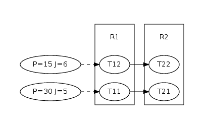

Static Priority Preemtive Example
=================================

Introduction
------------

In this section, we will dissect the SPP example which is representative for the ideas behind pyCPA.
The full source code of the example is shown at the end of this section.

Before we begin some general reminder:

pyCPA is NOT a tool! It rather is a package of methods and classes which 
can be embedded into your pyhon application - the spp example is such an example application.

Each pyCPA program consists of three steps:

* initialization
* setting up the architecture
* one or multiple scheduling analyses

The architecture can be entered in two ways,
either you provide it with the source code or you can use
an XML loader such as the Symta or the SMFF loader.
However, in most cases it is sufficient to code your architecture directly in a python file.
For this example we assume that our architecture consists of two resources (e.g. CPUs) scheduled by 
an static-priority-preemptive (SPP) scheduler and four tasks of which some communicate by event-triggering.
The environment stimulus (e.g. an sensor or input from another system)
is assumed to be periodic with jitter.
The application graph is shown on on the right.

.. First, each pyCPA application needs to call :py:func:`options.init_pycpa`.

Initialization
--------------

Now, let's look at the example.
Before we actually start with the program, we import all pycpa modules which are needed for this example

.. literalinclude:: ../examples/spp_test.py
   :language: python
   :lines: 16-20
   
The interesting module are :py:mod:`pycpa.spp` which contains scheduler specific algorithms,
:py:mod:`pycpa.graph` which is used to plot a task graph of this example and :py:mod:`pycpa.options`
which controls various modes in which pyCPA can be executed.

pyCPA can be initialized by :py:func:`pycpa.options.init_pycpa`.
This will parse the pyCPA related options such as the propagation method, verbosity,
maximum-busy window, etc.
Conveniently, this also prints the options which will be used for your pyCPA session.
This is handy, when you run some analyses in batch jobs and want are uncertain
about the exact settings after a few weeks.
However, the explicit call of this function is not necessary most of the time,
as it is being implicitly called at the beginning of the analysis.
It can be useful to control the exact time where the initialization happens
in case you want to manually override some options from your code.

System Model
------------
Now, we create an empty system, which is just a container for all other objects: 

.. literalinclude:: ../examples/spp_test.py
   :language: python
   :lines: 26-27

The next step is to create two resources R1 and R2
and bind them to the system via :py:func:`pycpa.model.System.bind_resource()`.
When creating a resource via :py:func:`pycpa.model.Resource()`,
the first argument of the constructor sets the resource id (a string)
and the second defines the scheduling policy.
The scheduling policy is defined by a reference to an instance of a 
scheduler class derived from :py:class:`pycpa.analysis.Scheduler`.
For SPP, this is :py:class:`pycpa.spp.SPPScheduler`.
In this class, different functions are defined
which for instance compute the multiple-event busy window on that resource
or the stopping condition for that particular scheduling policy. 
The stopping condition specifies how many activations of a task have to be considered for the analysis.
The default implementations of these functions from :py:class:`pycpa.analysis.Scheduler`
can be used for certain schedulers, 
but generally should be overridden by scheduler-specific versions. 
For SPP we have to look at all activations which fall in the level-i busy window, thus we choose the spp stopping condition. 

.. literalinclude:: ../examples/spp_test.py
   :language: python
   :lines: 31-32

The next part is to create tasks via :py:func:`pycpa.model.Resource()`
and bind them to a resource
via :py:func:`pycpa.model.Resource.bind_task()`.
For tasks, we pass some parameters to the constructor,
namely the identifier (string), the scheduling_paramter denoting the priority,
and the worst- and best-case execution times (wcet and bcet).

.. literalinclude:: ../examples/spp_test.py
   :language: python
   :lines: 34-40

In case tasks communicate with each other through event propagation (e.g. one task fills the queue of another task),
we model this through task links, 
which are created by :py:func:`pycpa.model.Task.link_dependent_task`
A task link is abstract and does not consume any additional time.
In case of communication-overhead it must be modeled by using other resources/tasks.
 
.. literalinclude:: ../examples/spp_test.py
   :language: python
   :lines: 42-44

Plotting the Task-Graph
-----------------------
       
Then, we plot the taskgraph to a pdf file by using
:py:func:`pycpa.graph.graph_system` from the graph module.

.. literalinclude:: ../examples/spp_test.py
   :language: python
   :lines: 50-51

Analysis
--------

The analysis is performed by calling :py:func:`pycpa.analysis.analyze_system()`.
This will will find the fixed-point of the scheduling problem and terminate if 
a result was found or if the system is not feasible (e.g. one busy window or the amount a propagations
was larger than a limit or the load on a resource is larger one).

.. literalinclude:: ../examples/spp_test.py
   :language: python
   :lines: 53-55
        
:py:func:`pycpa.analysis.analyze_system()` returns a dictionary with results for each task
in the form of instances to :py:class:`pycpa.analysis.TaskResult`.
Finally, we print out some of the results:

.. literalinclude:: ../examples/spp_test.py
   :language: python
   :lines: 57-61       

The output of this example is:

.. literalinclude:: spp-test.out
   :language: none

As you can see, the worst-case response times of the tasks 
are 10, 13, 2 and 19.

   
This is the full spp-test file.

.. literalinclude:: ../examples/spp_test.py
