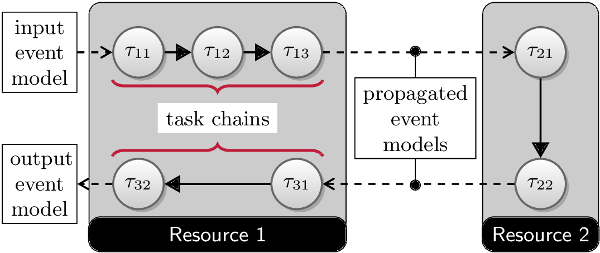

Tutorial
=================================

.. contents:: 
   :local:
   :depth: 1

Introduction
------------

In this section, we will assemble several pyCPA examples step-by-step.

Before we begin some general reminder:

pyCPA is NOT a tool! It rather is a package of methods and classes which 
can be embedded into your python application.

Each pyCPA program consists of three steps:

* initialization
* setting up the architecture
* one or multiple scheduling analyses

The architecture can be entered in two ways,
either you provide it with the source code or you can use
an XML loader such as the SMFF loader, the Almathea parser or the task chain parser.
However, in most cases it is sufficient to code your architecture directly in a python file on which we will focus in
this tutorial.

Initialization
--------------

Now, let's look at the example.
Before we actually start with the program, we import the all pycpa modules 

.. literalinclude:: ../examples/tutorial.py
   :language: python
   :lines: 12
   
Note that a few modules - such as the :py:mod:`pycpa.smff_loader`, :py:mod:`pycpa.cparpc` and :py:mod:`pycpa.simulation` - must be imported explicitly as they require additional third-party modules.

pyCPA can be initialized by :py:func:`pycpa.options.init_pycpa`.
This will parse the pyCPA related options such as the propagation method, verbosity,
maximum-busy window, etc.
Conveniently, this also prints the options which will be used for your pyCPA session.
This is handy, when you run some analyses in batch jobs and want are uncertain
about the exact settings after a few weeks.
However, the explicit call of this function is not necessary most of the time,
as it is being implicitly called at the beginning of the analysis.
It can be useful to control the exact time where the initialization happens
in case you want to manually override some options from your code.

Step 1: Base Scenario
----------------------

In the first step, we want to model and analyse our base scenario as depicted in the figure.
It comprises two CPUs, a bus and two task chains.
Task T11 and T12 execute on CPU1 and, once completed, activate the bus-communication tasks T21 and T22
respectively.
On CPU2, T31 and T32 are activated by their preceding communication tasks.

   Base scenario

System Model
^^^^^^^^^^^^
First, we create an empty system, which is just a container for all other objects: 

.. literalinclude:: ../examples/tutorial.py
   :language: python
   :lines: 50-51

The next step is to create the three resources
and bind them to the system via :py:func:`pycpa.model.System.bind_resource()`.
When creating a resource via :py:func:`pycpa.model.Resource()`,
the first argument of the constructor sets the resource id (a string)
and the second defines the scheduling policy.
The scheduling policy is defined by a reference to an instance of a 
scheduler class derived from :py:class:`pycpa.analysis.Scheduler`.
For SPP, this is :py:class:`pycpa.schedulers.SPPScheduler` which we use for both processing resources.
For the bus, we use :py:class:`pycpa.schedulers.SPNPScheduler`.

.. literalinclude:: ../examples/tutorial.py
   :language: python
   :lines: 53-57

The next part is to create tasks and bind them to a resource
via :py:func:`pycpa.model.Resource.bind_task()`.
For tasks, we pass some parameters to the constructor,
namely the identifier (string), the scheduling_parameter,
and the worst- and best-case execution times (wcet and bcet).
The scheduling_parameter is evaluated by the scheduler which was assigned to the resource.
For SPP and SPNP, it specifies the priority. By default higher numbers denote lower priorities.

.. literalinclude:: ../examples/tutorial.py
   :language: python
   :lines: 59-69

In case tasks communicate with each other through event propagation (e.g. one task fills the queue of another task),
we model this through task links, 
which are created by :py:func:`pycpa.model.Task.link_dependent_task`
A task link is abstract and does not consume any additional time.
In case of communication-overhead it must be modeled by using other resources/tasks.
 
.. literalinclude:: ../examples/tutorial.py
   :language: python
   :lines: 71-73

Last, we need to assign activation patterns (aka input event models) to the first tasks in the task chains, i.e. T11 and
T12.
We do this by assigning a periodic with jitter model, which is implemented by :py:func:`pycpa.model.PJdEventModel`.

.. literalinclude:: ../examples/tutorial.py
    :language: python
    :lines: 75-77

Plotting the Task-Graph
^^^^^^^^^^^^^^^^^^^^^^^
       
After creating the system model, we can use :py:func:`pycpa.graph.graph_system` from the graph module in order to visualize the task graph.
Here, we create a DOT (graphviz) and PDF file.

.. literalinclude:: ../examples/tutorial.py
   :language: python
   :lines: 15-16

Analysis
^^^^^^^^

The analysis is performed by calling :py:func:`pycpa.analysis.analyze_system()`.
This will will find the fixed-point of the scheduling problem and terminate if 
a result was found or if the system is not feasible (e.g. one busy window or the amount a propagations
was larger than a limit or a resource is overloaded).

.. literalinclude:: ../examples/tutorial.py
   :language: python
   :lines: 18-20
        
:py:func:`pycpa.analysis.analyze_system()` returns a dictionary with results for each task
in the form of instances to :py:class:`pycpa.analysis.TaskResult`.
Finally, we print out the resulting worst-case response times and the corresponding details of the busy-window in which the worst-case response-time was found.

.. literalinclude:: ../examples/tutorial.py
   :language: python
   :lines: 27-32       

The output of this example is:

.. literalinclude:: tutorial.out
   :language: none
   :lines: 1-52

As you can see, the worst-case response times of the tasks 
are 11, 11, 10, 13, 11 and 3.
We can also see, that for T21, a lower-priority blocker (T22) has been accounted as required for SPNP scheduling.

End-to-End Path Latency Analysis
^^^^^^^^^^^^^^^^^^^^^^^^^^^^^^^^

After the WCRT analysis, we can additionally calculate end-to-end latencies of task chains. 
For this, we first need to define :py:class:`pycpa.model.Path` objects and bind them to the system 
via :py:func:`pycpa.model.System.bind_path()`.
A path is created from a name and a sequence of tasks.
Note that, the tasks will be automatically linked according to the given sequence if the corresponding task links are not already
registered.

.. literalinclude:: ../examples/tutorial.py
    :language: python
    :lines: 79-81

The path analysis is invoked by :py:func:`pycpa.path_analysis.end_to_end_latency()` with the path to analysis, the
task_results dictionary and the number of events.
It returns the minimum and maximum time that it may take on the given path to process the given number of events.

.. literalinclude:: ../examples/tutorial.py
    :language: python
    :lines: 34-37

The corresponding output is:

.. literalinclude:: tutorial.out
    :language: none
    :lines: 53-54

Step 2: Refining the Analysis
-----------------------------

In this step, we show how analysis and propagation methods can be replaced in order to apply an improved analysis.
More precisely, we want to exploit inter-event stream correlations that result from the SPNP scheduling on the bus as
published in [Rox2010]_.

.. figure:: _static/step2.png
   :align:   right

   Refining the Analysis

System Model
^^^^^^^^^^^^

We use the same system model as before but replace the scheduler on CPU2 by
:py:class:`pycpa.schedulers.SPPSchedulerCorrelatedRox`.

.. literalinclude:: ../examples/tutorial.py
    :language: python
    :lines: 94

This scheduler exploits inter-event stream correlations that are accessed via the :py:func:`correlated_dmin()` function
of the input event models.
It therefore requires this function to be present for all event models on this resource (CPU2).
We achieve this by replacing the propagation method by :py:class:`pycpa.propagation.SPNPBusyWindowPropagationEventModel` for alls tasks on the bus.

.. literalinclude:: ../examples/tutorial.py
    :language: python
    :lines: 95-96

This results in the following analysis output:

.. literalinclude:: tutorial.out
   :language: none
   :lines: 56-71

You can see that the WCRT of T31 improved from 11 to 5.

Step 3: Junctions and Forks
---------------------------

In this step, we illustrate the use of junctions and forks.
Junctions need to be inserted to allow combining multiple input event streams according to a given strategy.
Forks can be used if a task has multiple dependent tasks (successors).
A customized fork strategy can be used if different event models shall be propagated to these tasks (e.g. in case of hierarchical event streams [Rox2008]_).
In this example (see figure), we model the scenario that T12 and T13 produce data that is transmitted by the same bus message which
is received by the RX task on CPU2.
Depending on whether T12 or T13 issued the message, T32 or T33 will be activated respectively.
Hence, junctions and forks enable modelling complex scenarios such as multiplexing and demultiplexing of messages as in [Thiele2015]_.

   Junctions and forks

System Model
^^^^^^^^^^^^

Again, we start with the same system model as presented in the base scenario but remove the dependencies between T12,
T22 and T32 by resetting :py:attr:`next_tasks` attribute.
Note that modifying a system model in such a way is not recommended but used for the sake of brevity in this tutorial.

.. literalinclude:: ../examples/tutorial.py
    :language: python
    :lines: 132-134

Next, we add the additional tasks T31 and TX to CPU1 and specify an input event model for T31.

.. literalinclude:: ../examples/tutorial.py
    :language: python
    :lines: 136-140

Now, we need a junction in order to combine the output event models of T12 and T13 into and provide the input event model of TX.
This is achieved by registering a :py:class:`pycpa.model.Junction` to the system via :py:func:`pycpa.model.System.bind_junction()`.
A junction is assigned a name and a strategy that derives from :py:class:`pycpa.analysis.JunctionStrategy`.
Some strategies are already defined in the :py:mod:`pycpa.junctions` module.
Here, we use the :py:class:`pycpa.junctions.ORJoin` in order to model that TX will be activated whenever T12 or T13 produce an output event.

.. literalinclude:: ../examples/tutorial.py
    :language: python
    :lines: 142-143

Of course, we also need to add the corresponding task links.

.. literalinclude:: ../examples/tutorial.py
    :language: python
    :lines: 145-150

On CPU2, we also need to add new tasks: T31 and RX.
More specifically, we add RX as a :py:class:`pycpa.model.Fork` which inherits from :py:class:`pycpa.model.Task`.
A fork also requires a strategy. Here, we use :py:class:`PathJitterForkStrategy` that we explain later in `Writing a Fork
Strategy`_.

Before that, let us register the missing task links.

.. literalinclude:: ../examples/tutorial.py
    :language: python
    :lines: 158-163

A fork also allows adding a mapping from its dependent tasks to for instance an identifier or an object that will be
used by the fork strategy to distinguish the extracted event models.
We use this in order to map the tasks T32 and T33 to T12 and T13 respectively.

.. literalinclude:: ../examples/tutorial.py
    :language: python
    :lines: 165-167

Writing a Fork Strategy
^^^^^^^^^^^^^^^^^^^^^^^

In this example, we want to extract separate input event models for T32 and T33 as T32 (T33) will only be activated by
messages from T12 (T13).
This can be achieved by encapsulating several inner event streams into an outer (hierarchical) event streams as
presented in [Rox2008]_.
Basically, the jitter that the outer event stream experiences can be applied to the inner event streams.
Hence, we need to write a fork strategy that extract the inner (original) event streams before their combination by the
junction and applies the path jitter that has been accumulated from the junction to the fork.
A fork strategy must implement the function :py:func:`output_event_model()` which returns the output event model for a given
fork and one of its dependent tasks.
Our fork strategy uses the previously specified mapping to get the corresponding source task (i.e. T12 and T13) and
creates the path object via :py:func:`pycpa.util.get_path()`.
The jitter propagation is then implemented by inheriting from :py:class:`pycpa.propagation.JitterPropagationEventModel` but using
the path jitter (worst-case latency - best-case latency) instead of the response-time jitter (wcrt-bcrt).

.. literalinclude:: ../examples/tutorial.py
    :language: python
    :lines: 104-130

Analysis
^^^^^^^^

When running the analysis, we obtain the following output:

.. literalinclude:: tutorial.out
    :language: none
    :lines: 73-94

Plotting Event Models
^^^^^^^^^^^^^^^^^^^^^

Now, we are interested in the event models that were extracted by the fork.
For this, we use the :py:mod:`pycpa.plot` module to plot and compare the input event model of T12 and T32.

.. literalinclude:: ../examples/tutorial.py
    :language: python
    :lines: 169
.. literalinclude:: ../examples/tutorial.py
    :language: python
    :lines: 22-25

   Input event model of T12.

   Input event model of T32.

Step 4: Cause-Effect Chains
---------------------------

In this step, we demonstrate how we can compute end-to-end latencies for cause-effect chains.
In contrast to a path, which describes an event stream across a chains of (dependent) tasks, a cause-effect chain
describes a sequence of independently (time-)triggered tasks.
In both cases, data is processed by a sequence of tasks but with different communication styles between the tasks.

   Cause-Effect Chains

We modify the base scenario by moving from single-core CPUs to multiple cores per CPU.
More precisely, we added one core to CPU1 as illustrated in the figure to the right:

.. literalinclude:: ../examples/tutorial.py
   :language: python
   :lines: 176-177

We also a new task to both cores:

.. literalinclude:: ../examples/tutorial.py
   :language: python
   :lines: 179-183

.. literalinclude:: ../examples/tutorial.py
   :language: python
   :lines: 179-183

Now we define an effect chain comprising T01, T02 and T11.

.. literalinclude:: ../examples/tutorial.py
   :language: python
   :lines: 185

Note that every task in the effect chain has its own periodic input event model.
In contrast to activation dependencies (solid black arrows in the figure), the data dependencies within the effect chain are illustrated by blue dotted arrows.

Analysis 
^^^^^^^^

The effect chain analysis is performed similar to the path analysis.
Note that there are two different latency semantics: reaction time and data age.
Here, we are interested in the data age.

.. literalinclude:: ../examples/tutorial.py
   :language: python
   :lines: 39-44

When running the analysis, we obtain the following output:

.. literalinclude:: tutorial.out
   :language: none
   :lines: 96-117

Step 5: Complex Run-Time Environments
-------------------------------------

It has been shown that CPA may provide very conservative results if a lot of task dependencies are present on a single
resource [Schlatow2016]_.
The general idea to mitigate this is to only use event model propagation at resource boundaries as illustrated in the
figure to the right.
On the resource itself, we end up with task chains that can be analysed as a whole with the busy-window approach (see [Schlatow2016]_, [Schlatow2017]_).

   Task Chains

The implementation of this approach is available as an extension to the pyCPA core at `<https://bitbucket.org/pycpa/pycpa_taskchain>`_.
It replaces the :py:class:`pycpa.model.Resource` with a `TaskchainResource` and also the Scheduler with an appropriate
implementation.

Hence, we need to import the modules as follows:

.. literalinclude:: ../examples/tutorial.py
   :language: python
   :lines: 191-192

We then model the scenario depicted in the figure as follows:

.. literalinclude:: ../examples/tutorial.py
   :language: python
   :lines: 197-228

When running the analysis, we get the task-chain response time results as the results for the last task in each chain: 

.. literalinclude:: tutorial.out
   :language: none
   :lines: 119-131

